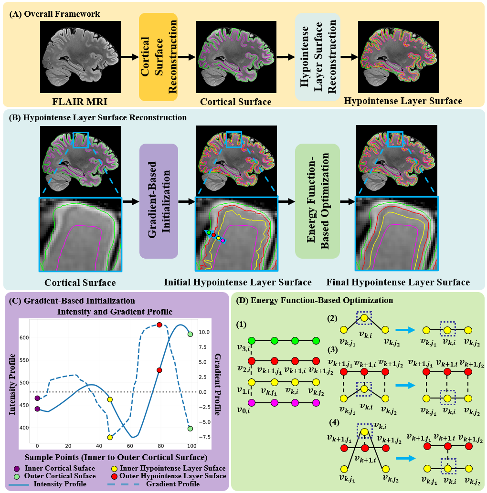

# BrainMLSR
实现BrainMLSR流程
## 1. BrainMLSR流程

  
   
  <em>Figure 1: pipeline.</em>

先得皮层内外表面。注意皮层内外表面的顶点必须一一对应并且具有相同的三角形面片关系。
然后再通过BrainMLSR进行多信号层重建

## 1. 皮层内外表面重建
为了便于广泛使用，我们以使用freesurfer为例，进行说明
现在有的图像，T1.nii.gz和T2FLAIR.nii.gz。
### 1.标准化到0.5mm
'''
mri_convert T1.nii.gz T1_05.nii.gz -cs 0.5
mri_convert T2.nii.gz T2FLAIR_05.nii.gz -cs 0.5
'''
### 2.T1配准到T2FLAIR图像
T1_05.nii.gz --> T1_05_reg.nii.gz

### 3.用FreeSurfer对T1进行皮层重建
'''
recon-all -all -i T1_05_reg.nii.gz -s "$SUBJECT_NAME" -openmp 8
'''

## 2.BrainMLSR

### 1. 初始表面提取
'''
python /home_data/home/caoshui2024/Pipeline/pipeline/code/initial_surface_gradient.py \
    --white  $RH_WHITE  \
    --pial $RH_PIAL \
    --T1 $T1_use \
    --T2flair $T2flair_use \
    --output_dir $initial_surface_OUTPUT_DIR \
    --hemisphere "rh"
'''

### 2. 多信号层表面优化
'''
python /home_data/home/caoshui2024/Pipeline/pipeline/code/refine.py \
    $INNER_WHITE $PIAL_SURF $LAYER_45_WHITE $LAYER_34_WHITE $T2_GRADIENT_IMAGE $lh_granular_inner $lh_granular_outer
'''

